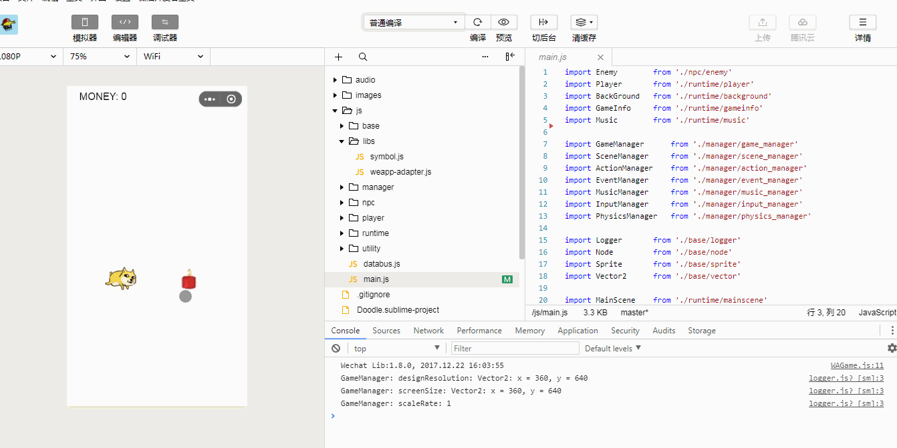

## Doge Jump
A simple demo game on WeChat MiniGame Platform  


### How to Run
* Download WeChat Developer Tools：
  [开发者工具下载页面](https://mp.weixin.qq.com/debug/wxagame/dev/index.html)

* Download or Clone Source Code

* Open Project by WeChat Developer Tools

### Source Code Structure
```
./js
|-- base                                    // 基础类
|   |-- animation.js                        // 帧动画
|   |-- button.js                           // UI控件：Button
|   |-- logger.js                           // 日志
|   |-- node.js                             // 游戏基本节点，类似于GameObject
|   |-- rect.js                             // 数据结构：矩形，用于包围盒等
|   |-- scene.js                            // 场景节点
|   |-- selectable.js                       // UI控件：可接收点击的节点
|   |-- sprite.js                           // 游戏基本节点，比Node区别在于Sprite用于可见的物体
|   |-- text.js                             // UI控件：文字
|   `-- vector.js                           // 数据结构：向量，用于坐标点等
|-- libs 
|   |-- symbol.js                           // ES6 Symbol 简易兼容
|   `-- weapp-adapter.js                    // 小游戏适配器
|-- manager                                 // 各种管理类
|   |-- action                              // 每个节点可执行的动作
|   |   |-- action.js
|   |   `-- action_callfunc.js
|   |-- action_manager.js                   // 动作管理
|   |-- event_manager.js                    // 事件管理
|   |-- game_manager.js                     // 存放游戏数据
|   |-- input_manager.js                    // 用户输入，处理屏幕点击等
|   |-- manager.js                          // 管理类的基类
|   |-- music_manager.js                    // 音效
|   |-- physics_manager.js                  // 简易物理，处理碰撞检测等
|   `-- scene_manager.js                    // 场景管理，处理场景切换等
|-- runtime                                 // 运行时的各个具体类
|   |-- background.js                       // 背景
|   |-- mainscene.js                        // 主场景节点
|   |-- player.js                           // 玩家
|   |-- playscene.js                        // 游戏场景节点
|   |-- redpocket_creator.js                // 红包
|   `-- rock_creator.js                     // 障碍物
|-- utility                                 // 一些工具类
|   `-- utility_string.js
`-- main.js                                 // 游戏入口函数

```